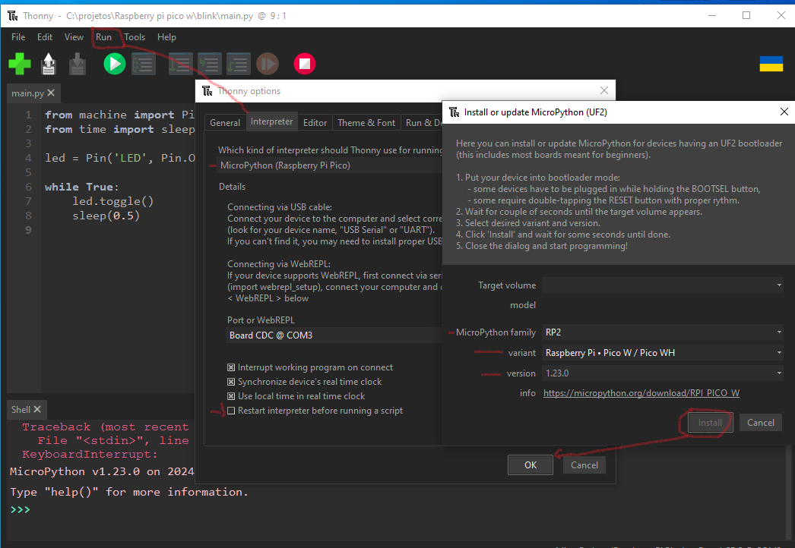

## Reproduce 

### BLINK with Raspberry Pi Pico W and Micropython
Download the [Thony IDE](https://thonny.org/) latest version.  
Configure Rasp. Pi Pico W to install correct MicroPython:  
  

Restart IDE and Device.  
Source code:  
```python
from machine import Pin
from time import sleep

led = Pin('LED', Pin.OUT)

while True:
    led.toggle()
    sleep(0.5)'
```
Now click in Icon (>) RUN, check board led.
